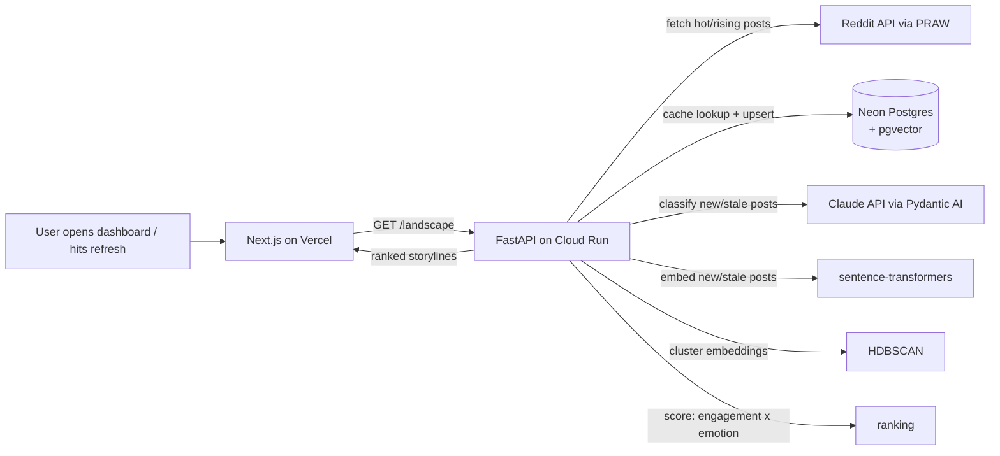

# Architecture

How the Emotion-Aware Analytics System is put together, and why.

## Overview



The entire pipeline runs inside a single request. There is no background process, message queue, task scheduler, or push channel anywhere in this system — that's a deliberate design decision, not an early-stage simplification to be "fixed" later.

## Why this shape

This went through a few real revisions before landing here — worth recording briefly, since the reasoning is as much the engineering story as the final design:

1. **Started as a continuous streaming pipeline** (Reddit poller → Kafka → worker → time-series DB → live WebSocket push), on the theory that "real-time monitoring" meant "always running."
2. **Cost research forced a rethink.** Checking current 2026 pricing (not assuming) showed Fly.io's free tier is gone, Upstash Kafka is discontinued, and Render's free tier can't hold an always-on process — a fully self-hosted, always-on version of that pipeline would run $30-80+/mo. That pushed toward self-hosting everything on a single genuinely-free Oracle Cloud VM instead, with Kafka swapped for Redis Streams.
3. **The real fix wasn't cheaper always-on hosting — it was realizing "always-on" was the wrong requirement.** Nothing here needs sub-second latency; "what's happening on Reddit right now" is naturally a pull, not a push. Once the system only has to run when someone actually opens it, an entire tier of infrastructure (queue, task scheduler, broker, live-push channel, and the server they'd all have to live on) becomes unnecessary rather than just cheaper.

**Why each remaining piece:**
- **FastAPI on Cloud Run** — Cloud Run has a genuine Always-Free quota (2M requests/month) and real scale-to-zero, which is the correct fit once nothing needs to run between requests. (Cloud Run was rejected earlier specifically because it can't host a stateful broker — that constraint no longer applies once there's no broker.)
- **Neon Postgres + pgvector** — also genuinely free and scale-to-zero (suspends after ~5 min idle, wakes in ~200ms). Its only jobs are caching classifications (so a re-open doesn't re-pay Claude for a post it already scored) and opportunistically accumulating history from real usage, so a lightweight trend view is possible without ever running a poller.
- **HDBSCAN clustering (scikit-learn)** — groups near-duplicate posts about the same event into a single ranked "storyline" instead of a feed cluttered with copies. Chosen over k-means-style methods specifically because it doesn't require knowing the number of storylines in advance — that number is different on every request.
- **Priority score = blend of engagement velocity and emotional intensity** — the actual product differentiator. Reddit's own "hot" sort already ranks by engagement; ranking purely by emotional intensity would let a barely-upvoted post dominate. The blend (weights configurable via env vars) is what makes "priority-wise, ranked" mean something beyond what Reddit already shows.
- **Pydantic AI + `claude-haiku-4-5`** — the emotion taxonomy is a `pydantic.BaseModel`; Pydantic AI generates the Claude tool schema and validates the response. Haiku is the default model since this classifies a batch of posts per request, not a single interactive query — swappable to `claude-sonnet-5` via `CLAUDE_MODEL`.
- **Next.js + TypeScript + Tailwind on Vercel** — a plain fetch-and-render dashboard now; no WebSocket, since there's no background process generating updates to push. A "Refresh" action with a loading state while the backend does live classification is honest UX for what's actually happening.

## What's deliberately not here

Kafka, Redis, Celery/Celery Beat, WebSockets, TimescaleDB, a background alerting system, and any always-on server or VM. Each existed in an earlier revision of this design to serve continuous ingestion or live push — neither is needed once the system is request-driven. See the plan history above for why each was dropped rather than just assuming they were never considered.

## Directory structure

```
emotion-aware-analytics-system/
├── api/                     # FastAPI — the entire backend, deployed to Cloud Run
│   └── src/
│       ├── reddit_source.py    # on-demand fetch + normalize
│       ├── classify.py         # Pydantic AI Claude call
│       ├── embeddings.py       # sentence-transformers
│       ├── ranking.py          # HDBSCAN clustering + priority scoring
│       ├── db.py               # Neon cache/history
│       └── routes/landscape.py # GET /landscape — the one real endpoint
├── db/migrations/           # SQL: emotion_events table + pgvector index
├── scripts/seed_demo_data.py
└── web/                     # Next.js dashboard, deployed to Vercel
```

## Data model

`emotion_events` is a plain indexed Postgres table (not a hypertable — there's no continuous ingestion to justify one), storing each classified post's Plutchik scores, valence/arousal, a 384-dim embedding, and enough Reddit metadata (score, comment count, timestamp) to compute engagement velocity at ranking time. `unique (source, external_id)` makes classification idempotent — re-fetching the same post is a cache hit, not a re-classification.

## Cost model

Cloud Run, Neon, and Vercel free tiers cover all infrastructure at $0/month. The only real recurring cost is the Claude API, bounded by: the Haiku default model, an engagement filter (`MIN_ENGAGEMENT_SCORE`) that drops low-signal posts before they're ever sent to Claude, the classification cache (re-opening the app doesn't re-classify unchanged posts), and a spend cap set manually in the Anthropic Console.
